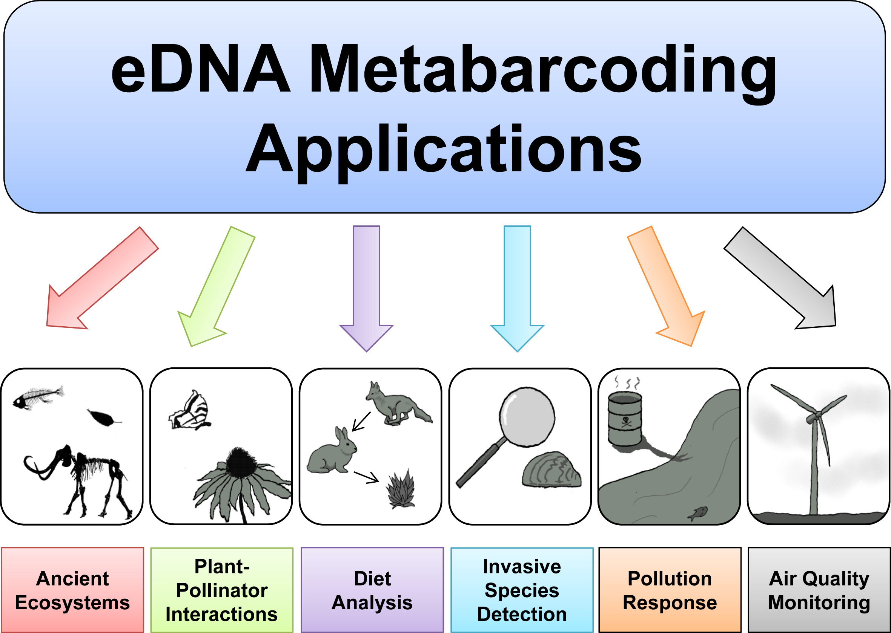
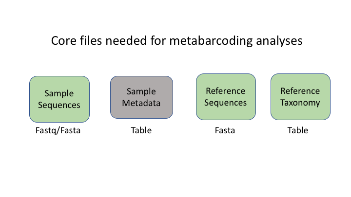
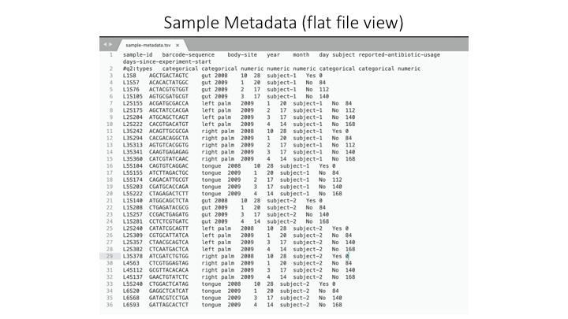
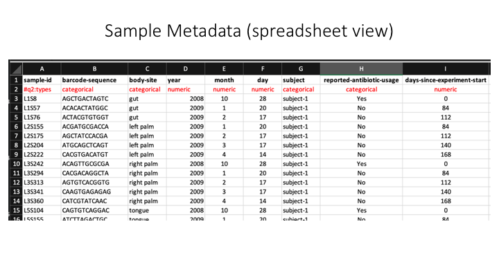
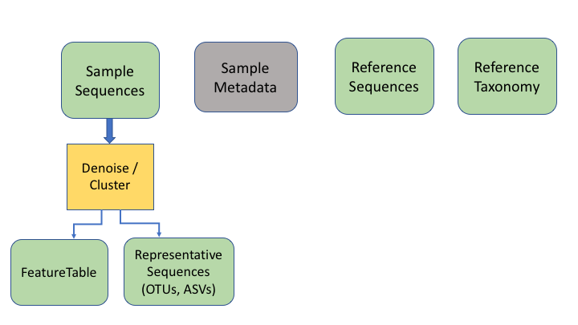
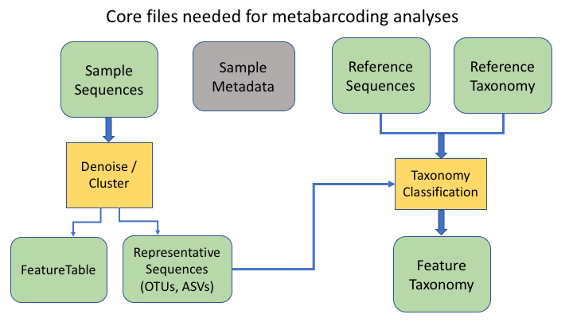
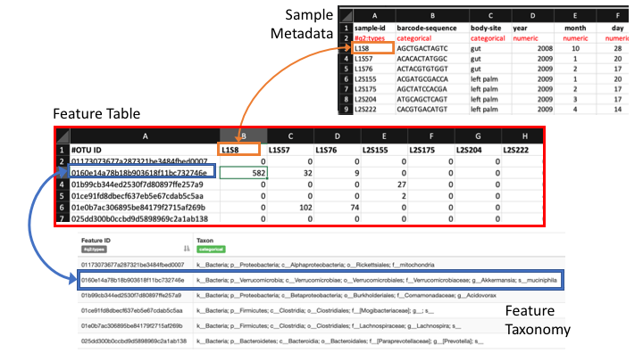
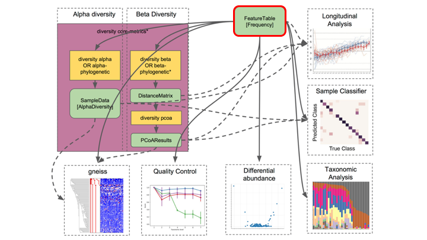
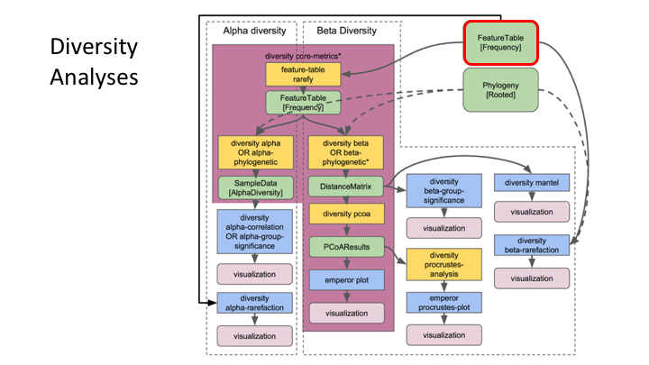

<center> <h1>eDNA Workshop</h1> </center>


The primary goal of this course is to introduce students to the analysis of environmental DNA data. The set of methods that broadly has to do with the analysis of nucleic material from the environment is called <a href="https://en.wikipedia.org/wiki/Metagenomics" target="_blank" rel="noopener noreferrer"><b>Metagenomics</b></a>. Usually this refers to **shotgun metagenomics**, which utilises shotgun next-generation sequencing (NGS). However, there are several techniques used nowadays for analysing eDNA, including bait capture, qPCR, and metatranscriptomics (eRNA). This course will cover <a href="https://en.wikipedia.org/wiki/Environmental_DNA#eDNA_metabarcoding" target="_blank" rel="noopener noreferrer"><b>eDNA metabarcoding</b></a> , which involves using PCR amplification of one or a few genes on DNA extracted from environmental samples. 


<center></center>

<br><br>

## Major software programs used for eDNA metabarcoding

There are a number of software packages and pipelines that are available for eDNA metabarcoding (hereafter referred to as just metabarcoding). We will go over several of these programs in the course of this workshop. It would be inpractical to cover all of them, but one of the objectives of this course is to show the student how to interact with multiple programs without getting too bogged down. We feel it is important to keep a flexible approach so that the student ultimately has more tools at their disposal. We will only cover a handful of programs here, but hopefully you will leave the course having learned *how to learn* a new program. You will see all the steps from raw data to publication-quality graphs. 

Some of the major programs for metabarcoding (those marked with a '*' will be covered in this workshop):

- **Qiime2\*** is actually a collection of different programs and packages, all compiled into a single ecosystem so that all things can be worked together. On the <a href="https://docs.qiime2.org/2021.4/" target="_blank" rel="noopener noreferrer"><b>Qiime2 webpage</b></a> there is a wide range of tutorials and help. We will use this program to do the taxonomy analyses, but we will also show you how to easily import and export from this format so you can combine with other programs. 

- **Dada2** is a good program, run in the R language. There is good documentation and tutorials for this on its <a href="https://benjjneb.github.io/dada2/" target="_blank" rel="noopener noreferrer"><b>webpage</b></a>. You can actually run Dada2 within Qiime, but there are a few more options when running it alone in R. 

- **USEARCH** (<a href="https://www.drive5.com/usearch/" target="_blank" rel="noopener noreferrer"><b>webpage</b></a>), and the open-source version (which we will use)  (<a href="https://github.com/torognes/vsearch" target="_blank" rel="noopener noreferrer"><b>VSEARCH*</b></a>), has many utilities for running metabarcoding analyses. Many of the most common pipelines use at least some of the tools from these packages.

- **Mothur** has long been a mainstay of metabarcoding analyses, and is <a href="https://mothur.org/" target="_blank" rel="noopener noreferrer"><b>worth a look</b></a>

- Another major program for metabarcoding is **OBITools**, which was one of the first to specialise in non-bacterial metabarcoding datasets. The newer version, updated for Python 3, is currently in Beta. Check the <a href="https://git.metabarcoding.org/obitools/obitools3/wikis/home" target="_blank" rel="noopener noreferrer"><b>main webpage</b></a> to keep track of its development. 
    
Additionally, there are several good R packages that we will use to analyse and graph our results. Chief among these are **Phyloseq\*** and **DECIPHER\***.


## Metabarcoding Basics

Most metabarcoding pipelines and software use similar tools and methodological approaches, and there are a common set of file types. The methods and the underlying concepts will be presented as we go through the example sets, but to start off, here we introduce a basic tool kit for metabarcoding (aside from the specific software packages themselves), and review the basic file types and formats that will be used for this course, and for most metabarcoding. If you have a firm grasp of these files, then it will be easier to transform your data so it can be used with almost any metabarcoding software package. 

<br>

## Basic tool kit

- The terminal, aka Command Line Interface (CLI).

- A text editor. Two of the best that can work on any platform are <a href="https://www.sublimetext.com/" target="_blank" rel="noopener noreferrer"><b>Sublime Text</b></a> and <a href="https://code.visualstudio.com/" target="_blank" rel="noopener noreferrer"><b>Visual Studio Code</b></a>. For Macs, <a href="https://www.barebones.com/products/bbedit/" target="_blank" rel="noopener noreferrer"><b>BBEdit</b></a> is a popular choice. And for Windows, <a href="https://notepad-plus-plus.org/" target="_blank" rel="noopener noreferrer"><b>Notepad++</b></a> is tried and true. <a href="https://atom.io/" target="_blank" rel="noopener noreferrer"><b>Atom</b></a> is a good open source option.


- <a href="https://rstudio.com/" target="_blank" rel="noopener noreferrer"><b>RStudio</b></a>, an all-in-one package for R.

<br>

## Building blocks of metabarcoding

There are six basic kinds of information that are common to all metabarcoding analyses. In some programs, the information may be combined into fewer files. In other programs, such as Qiime2, the files are largely separate. For the purposes of clarity, we will present these as separate files.

The first two data types have to do with your sample data: your sequence data, and the metadata holding information about each sample. The next two are for the taxonomic references that are used to determine the species composition of the samples. 




## Sequence files: fastq and fasta 

The first files are fastq and fasta files. We will process these in the next section so we will have a look at these file types then.

<br>

## Sample Metadata

In Qiime the sample metadata is a simple tab-delimited file with information for each sample:



<br>

Here is a spreadsheet view, so the different categories are clearer:



Now we will open the sample metadata file that we will use in this course. In JupyterHub, navigate to the docs folder. You will see a file called *sample_metadata.tsv*. Double-click on this file and it will open in a new tab on Jupyter. You will see that Jupyter recognises this file as a table, because of the `.tsv` suffix.

## Taxonomy files

The format of taxonomy files varies depending on the program you are running. In Qiime, there are two files: one is a fasta file with the reference sequences. 

```
>MW856870
ACAAGACAGATCACGTTAAACCCTCCCTGACAAGGGATTAAACCAAATGAAACCTGTCCTAATGTCTTTGGTTGGGGCGACCGCGGGGAAACAAAAAACCCCCACGTGGA...
```

This is accompanied by a taxonomy table that shows the taxonomic lineage for each sequence ID:

```
MW856870	d__Eukaryota;p__Chordata;c__Actinopteri;o__Perciformes;f__Percidae;g__Percina;s__Percina_roanoka
```

Other formats combine this information into one file: a fasta file with the lineage information on the sequence id line. For example, the program Sintax:

```
>MW856870;tax=k:Eukaryota,p:Chordata,c:Actinopteri,o:Perciformes,f:Percidae,g:Percina,s:Percina_roanoka
ACAAGACAGATCACGTTAAACCCTCCCTGACAAGGGATTAAACCAAATGAAACCTGTCCTAATGTCTTTGGTTGGGGCGACCGCGGGGAAACAAAAAACCCCCACGTGGA...
```

<br>

## OTU files

The next two information types come after clustering the sample sequences. The general Qiime2 terminology for these are the *representative sequences* and the *feature table*. The representative sequences (rep seqs) are also known as *Operational Taxonomic Units* (OTUs), *Amplicon Sequence Variants* (ASVs), *Exact Sequence Variants* (ESVs), or *zero radius OTUs* (zOTUs), depending on how they are produced (e.g. clustering or denoising). The last type is a table that specifies how many sequences of each rep seq are found in each sample.




To keep things simple, we will refer to all of these types as OTUs, as that is the oldest and most widely recognised term.

An additional important data type is the product of taxonomy classification of the representative sequences, here called the *feature taxonomy*




## Feature or frequency tables are key to metabarcoding analyses

The feature table ties together many sources of information in your analysis. It combines the per sample frequencies of each OTU, and to its taxonomic assignment, and these in turn can be linked to the sample metadata. 



Feature Tables are the centre of multiple downstream analyses



<br>




## Typical metabarcoding pipelines

Most metabarcoding workflows have mostly the same steps. The Qiime webpage has a good illustration of their pipeline:


Here are the OBITools and Qiime pipelines side-by-side. Though the steps are named somewhat differently, the methods employed are very similar.


## Tour of project subfolders

For any project, it is important to organise your various files into subfolders. Through the course you will be navigating between folders to run your analyses. It may seem confusing or tedious, especially as there are only a few files. Remember that for many projects you can easily generate hundreds of files, so it is best to start with good practices from the beginning. 

your `edna` folder has been copied to your home folder. It has the following subfolders:

- docs/
- data/
- otus/
- taxonomy/
- scripts/
- plots/
- notebooks/

Most of these are empty, but by the end of the course they will be full of the results of your analysis. 

