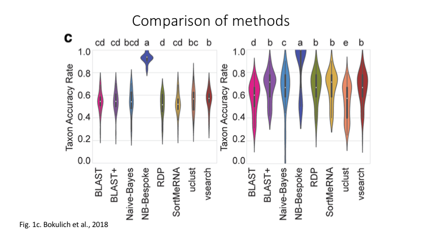
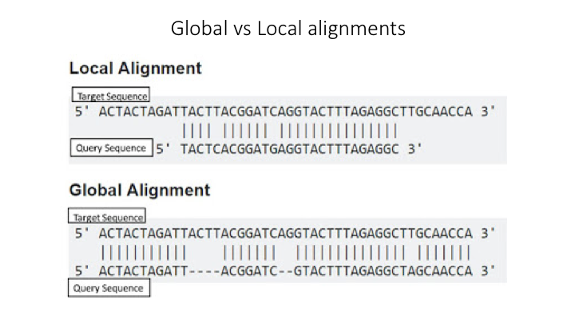

# Taxonomy Assignment: Different Approaches

There are three basic approaches to taxonomy classification (and endless variations of each of these): Global alignment, local alignment, and Naive Bayes, or machine learning approaches in general. 



for a discussion of them see the <a href="https://microbiomejournal.biomedcentral.com/articles/10.1186/s40168-018-0470-z" target="_blank" rel="noopener noreferrer"><b>paper</b></a>.


## Aligment-Based Methods

BLAST is one of the most common methods of searching DNA sequences. BLAST is an acronym for Basic Local Alignment Search Tool. It is called this because it looks for any short, matching sequence, or local alignments, with the reference. This is contrasted with a *global alignment*, which tries to find the best match across the entirety of the sequence.  




<br>

Though BLAST is widely used, it is not necessarily the best way to search for matching sequences in metabarcoding studies. 

<br><br>

## Using Machine Learning to Assign Taxonomy

Another way to assign taxonomy utilises machine learning algorithms. 


<br><br>


## Use Naive Bayes (machine learning) to classify in Qiime

In order to use the Naive Bayes (NB) method to assign taxonomy, it is necessary to train the sequence database first. Because this can take a great deal of time, a pre-trained classifier has been made available for you. The website for this course contains details of how this classifier was 'trained' **add link**. The <a href="https://docs.qiime2.org/2021.4/data-resources/" target="_blank" rel="noopener noreferrer"><b>Qiime2 Data Resources page</b></a> provides some pre-trained classifiers for common primer combinations, as well as links to the Greengenes and Silva databases for 16S and 18S gene studies. For additional primer combinations, or other gene references, there is a <a href="https://docs.qiime2.org/2021.4/tutorials/feature-classifier/" target="_blank" rel="noopener noreferrer"><b>tutorial for training feature classifiers</b></a>. 

Because this command can take a few minutes to run, we will run it as a slurm job. 

## Setting up SLURM job

First off, create a text file named `classify_nb.sl`. In this file, we first need to add the `#SBATCH` arguments to the file. In the script file there is a file called `slurm_job_script_template.sl`. Open this also, and copy the lines over to your new job script. We will fill in the `#SBATCH` arguments one by one. 

Your new script should now look like this:

```
#!/bin/bash -e
#SBATCH --account nesi02659
#SBATCH --job-name 
#SBATCH --time 
#SBATCH --nodes 
#SBATCH --cpus-per-task 
#SBATCH --ntasks 
#SBATCH --mem
#SBATCH --output .%j.out 
#SBATCH --error .%j.err 

# load the module


# go to directory


# run command

```


The first line has the usual shebang. You will notice the `-e` after this on that line. This option is in case there is an error somewhere in the script, then the job will stop right away.

Now let's go through the `#SBATCH` part. 

The `--account` line is for the project code. This is filled in. When you are working on your own data, you will fill in your own project code on this line.

The `--job-name` is for a code for this job. Keep this short, like `fish1` or `nb1`.

`--time` is for how long the job can run. You want to put enough to finish the job, but not too long or the job can sit on the queue for longer. The time goes hours\:minutes:seconds

For this job, enter `00:15:00` for 15 minutes.

`--nodes` is the number of nodes. Enter `1`

`--cpus-per-task` is the number of processors or CPUs to use. It is important to match this to the number you request for the particular program you are running. Enter `2` for this.

`--ntasks` is the number of parallel processes you run. This is usually `1` unless you are running programs in parallel. 

`--mem` is the amount of RAM you need. For this we will use `8G` for eight gigabytes. 

`--output` and `--error` are optional extras that record the output from the job run. Put the shorthand name of the job in front of the `.%j.out`/`.err` part.

This should now be ready to go.

The NeSI website has good documentation to help you with Slurm scripts. <a href="https://support.nesi.org.nz/hc/en-gb/articles/360000684396-Submitting-your-first-job" target="_blank" rel="noopener noreferrer"><b>Here is a good page that goes through these and other SBATCH options</b></a>


The rest of the script is as we have done before. The comment lines (with `#`s) indicate what to add. 

Add a line to load the Qiime module.

This will be run in the `/taxonomy` subfolder:

```
cd ../taxonomy
```

Now we will add the command. You will have a go at putting the command together. Here is a link to the Qiime plugin to run NB taxonomy:

<a href="https://docs.qiime2.org/2021.4/plugins/available/feature-classifier/classify-sklearn/" target="_blank" rel="noopener noreferrer"><b>Plugin for training feature classifiers</b></a>

To get you started:

```
qiime feature-classifier classify-sklearn \
```

- The OTUs are what we will classify
- Make sure you add all the arguments listed on the webpage as **[required]**
- The classifier you need is in your `/references` subfolder. It is called `lrRNA_fish_db_classifier.qza`
- The output file name is up to you, but make sure you use `.qza` as a suffix

In addition to the required arguments, also add the `--p-confidence` and `--p-n-jobs` options. For the first, check the default and use a higher number (but not higher than 1.0). For the second, this is the number of CPUs to use. Make sure it is not more than the `#SBATCH` option above.


Once you have completed the command, the job script is ready to go. To submit the job script to the queue:

```
sbatch classify_nb.sl
```


## Visualisation in Qiime

In Qiime, all the visuals are run as interactive web apps--they need to run on a web browser. In this course we will focus on creating graphs and plots using R. However, we have provided some links to visuals for the OTUs and taxonomy for this data set, in order to show how some of the visuals work. 

For all these plots, they need to be opened on a webpage called Qiime2View. Click on the following link to open it in a new tab:

<a href="https://view.qiime2.org/" target="_blank" rel="noopener noreferrer"><b>Qiime2View webpage</b></a>

To see a table of the taxonomy assignment of each OTU, paste the following link into the Qiime2View webpage (do not click on it).
https://otagoedna.github.io/2019_11_28_edna_course/example_viz/fish_NB_taxonomy_VIZ.qzv
Then go to the Qiime2View website, click on 'file from the web', and paste the link in the box that opens up.

The next plot is a barplot graph of the taxonomy. A barplot graph is a good way to compare the taxonomic profile among samples. 

Paste the following link into the Qiime2View page:
https://otagoedna.github.io/2019_11_28_edna_course/example_viz/fish_NB_taxonomy_barplot.qzv
We are also including a table of the OTU sequences.
https://otagoedna.github.io/2019_11_28_edna_course/example_viz/zotus_tabulation.qzv
This visual shows the sequence for each OTU. You can run a BLAST search on each OTU by clicking on the sequence. However, the search can take a while, depending on how busy the NCBI server is.

<br><br>

## Exporting Qiime files

Within the Qiime2 multiverse, there is a lot of downstream analyses once you have your assigned taxonomy and your other inputs in Qiime format `.qza` (the sample metadata file is one of the few exceptions: it remains as a plain text file). However, as the stated goal of this course is to be able to interact with multiple programs, we are going to export the output from the taxonomy classification so that we can use it with other programs, specifically graphing in R. 

There is a handy qiime tool to do this. It has just two required options. In the terminal, load the qiime module if it is not loaded already, and run the help message:

```
module load QIIME2/2021.2

qiime tools export --help
```

you should see this output:

```
Usage: qiime tools export [OPTIONS]

  Exporting extracts (and optionally transforms) data stored inside an
  Artifact or Visualization. Note that Visualizations cannot be transformed
  with --output-format

Options:
  --input-path ARTIFACT/VISUALIZATION
                        Path to file that should be exported        [required]
  --output-path PATH    Path to file or directory where data should be
                        exported to                                 [required]
  --output-format TEXT  Format which the data should be exported as. This
                        option cannot be used with Visualizations
  --help                Show this message and exit.
```

Write a bash script (not a Slurm job) to export the taxonomy classification output. You will just need to use the `--input-path` and `--output-path` arguments. For Qiime exports, the `--output-path` argument only uses a path, not a file name. You will have to rename the output after exporting. The best is to create a folder called exports in the taxonomy folder. 

```
mkdir exports
```

Once you have run the script, you can rename the output and move it from the `/exports` folder to the main `/taxonomy` folder using the `mv` command. 

Once you have an exported, renamed taxonomy output, open the file (either in Jupyter or using Nano) and have a look. 

We will just need one more Qiime file exported for downstream analyses: the phylogenetic tree we created earlier (`rooted-tree.qza`). Write another bash script to export the tree file. (Hint: you will need another `/exports` folder in your 


<br><br>

## Extra exercise: run BLAST taxonomy assignment

Qiime2 has two other methods for taxonomy assignment. If you have some time, you can run BLAST as well to find taxonomy. 


https://docs.qiime2.org/2021.4/plugins/available/feature-classifier/classify-consensus-blast/

Hints:

- You will not use the trained data, instead for `--i-reference-reads` use the fasta.qza, and for `--i-reference-taxonomy` use the taxon.qza file. Both are in the reference folder

- Add the options `--p-perc-identity` and `--p-query-cov`, and try increasing the value for these. 

- Run it as a Slurm job. Increase the time given to 30 minutes.

