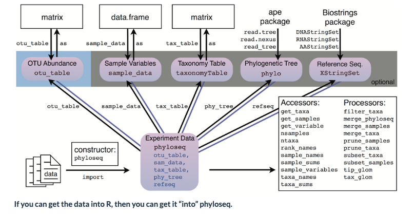
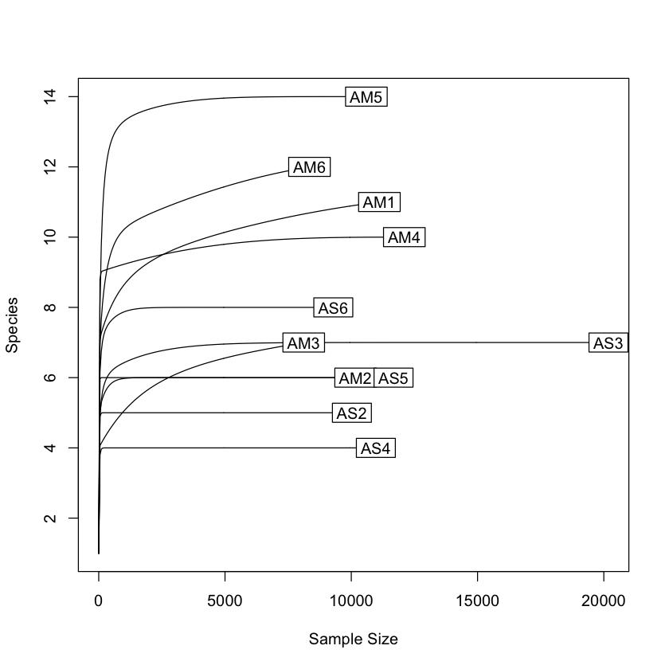
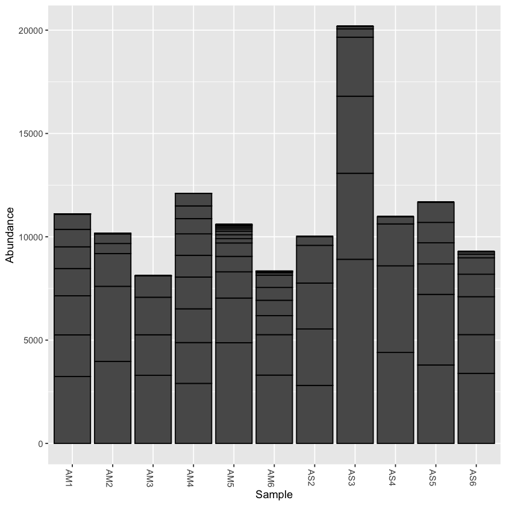
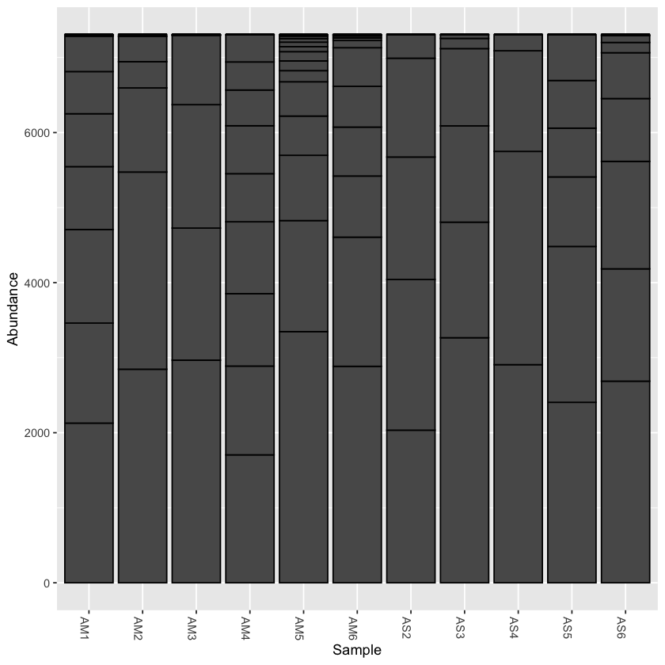

# Importing outputs into R

For examining the results of our analysis in R, we primarily be using the <a href="https://joey711.github.io/phyloseq/" target="_blank" rel="noopener noreferrer"><b>Phyloseq package</b></a>, with some additional packages.

There are many possible file and data types that can be imported into Phyloseq:




```R
# load the packages
library('phyloseq')
library('tibble')
library('ggplot2')
library('dplyr')
library('tidyr')
library('ape')
library('vegan')
library('stringr')
```


```R
# set the working directory
setwd('../plots')
```

## Import the frequency table


```R
import_table <- read.table('../otus/otu_frequency_table.tsv',header=TRUE,sep='\t',row.names=1, comment.char = "")
```


```R
head(import_table)
```


<table class="dataframe">
<caption>A data.frame: 6 × 11</caption>
<thead>
	<tr><th></th><th scope=col>AM1</th><th scope=col>AM2</th><th scope=col>AM3</th><th scope=col>AM4</th><th scope=col>AM5</th><th scope=col>AM6</th><th scope=col>AS2</th><th scope=col>AS3</th><th scope=col>AS4</th><th scope=col>AS5</th><th scope=col>AS6</th></tr>
	<tr><th></th><th scope=col>&lt;int&gt;</th><th scope=col>&lt;int&gt;</th><th scope=col>&lt;int&gt;</th><th scope=col>&lt;int&gt;</th><th scope=col>&lt;int&gt;</th><th scope=col>&lt;int&gt;</th><th scope=col>&lt;int&gt;</th><th scope=col>&lt;int&gt;</th><th scope=col>&lt;int&gt;</th><th scope=col>&lt;int&gt;</th><th scope=col>&lt;int&gt;</th></tr>
</thead>
<tbody>
	<tr><th scope=row>OTU.1</th><td> 723</td><td>3634</td><td>0</td><td>2907</td><td>171</td><td>1956</td><td>2730</td><td>2856</td><td>4192</td><td>3797</td><td>3392</td></tr>
	<tr><th scope=row>OTU.10</th><td>   0</td><td>   0</td><td>0</td><td>   0</td><td>  0</td><td>   0</td><td>2223</td><td>   0</td><td>   0</td><td>1024</td><td>   0</td></tr>
	<tr><th scope=row>OTU.11</th><td>1892</td><td>   0</td><td>0</td><td>   0</td><td> 82</td><td> 113</td><td>   0</td><td>   0</td><td>   0</td><td>   0</td><td>   0</td></tr>
	<tr><th scope=row>OTU.12</th><td>   0</td><td>1587</td><td>0</td><td>   0</td><td>  0</td><td>   0</td><td>   0</td><td>   0</td><td>   0</td><td>   0</td><td>   0</td></tr>
	<tr><th scope=row>OTU.13</th><td>   0</td><td>   0</td><td>0</td><td>   0</td><td>  0</td><td>   0</td><td>   0</td><td>   0</td><td>   0</td><td>1472</td><td>   0</td></tr>
	<tr><th scope=row>OTU.14</th><td>   0</td><td>   0</td><td>0</td><td>   0</td><td>  0</td><td>   0</td><td>   0</td><td>   0</td><td>   0</td><td>   0</td><td>1087</td></tr>
</tbody>
</table>


```R
# convert to a matrix for Phyloseq
otumat <- as.matrix(import_table)
head(otumat)
```


<table class="dataframe">
<caption>A matrix: 6 × 11 of type int</caption>
<thead>
	<tr><th></th><th scope=col>AM1</th><th scope=col>AM2</th><th scope=col>AM3</th><th scope=col>AM4</th><th scope=col>AM5</th><th scope=col>AM6</th><th scope=col>AS2</th><th scope=col>AS3</th><th scope=col>AS4</th><th scope=col>AS5</th><th scope=col>AS6</th></tr>
</thead>
<tbody>
	<tr><th scope=row>OTU.1</th><td> 723</td><td>3634</td><td>0</td><td>2907</td><td>171</td><td>1956</td><td>2730</td><td>2856</td><td>4192</td><td>3797</td><td>3392</td></tr>
	<tr><th scope=row>OTU.10</th><td>   0</td><td>   0</td><td>0</td><td>   0</td><td>  0</td><td>   0</td><td>2223</td><td>   0</td><td>   0</td><td>1024</td><td>   0</td></tr>
	<tr><th scope=row>OTU.11</th><td>1892</td><td>   0</td><td>0</td><td>   0</td><td> 82</td><td> 113</td><td>   0</td><td>   0</td><td>   0</td><td>   0</td><td>   0</td></tr>
	<tr><th scope=row>OTU.12</th><td>   0</td><td>1587</td><td>0</td><td>   0</td><td>  0</td><td>   0</td><td>   0</td><td>   0</td><td>   0</td><td>   0</td><td>   0</td></tr>
	<tr><th scope=row>OTU.13</th><td>   0</td><td>   0</td><td>0</td><td>   0</td><td>  0</td><td>   0</td><td>   0</td><td>   0</td><td>   0</td><td>1472</td><td>   0</td></tr>
	<tr><th scope=row>OTU.14</th><td>   0</td><td>   0</td><td>0</td><td>   0</td><td>  0</td><td>   0</td><td>   0</td><td>   0</td><td>   0</td><td>   0</td><td>1087</td></tr>
</tbody>
</table>


```R
# create a Phyloseq object using the function `otu_table`
OTU = otu_table(otumat, taxa_are_rows = TRUE)
head(OTU)
```


<table class="dataframe">
<caption>A otu_table: 6 × 11 of type int</caption>
<thead>
	<tr><th></th><th scope=col>AM1</th><th scope=col>AM2</th><th scope=col>AM3</th><th scope=col>AM4</th><th scope=col>AM5</th><th scope=col>AM6</th><th scope=col>AS2</th><th scope=col>AS3</th><th scope=col>AS4</th><th scope=col>AS5</th><th scope=col>AS6</th></tr>
</thead>
<tbody>
	<tr><th scope=row>OTU.1</th><td> 723</td><td>3634</td><td>0</td><td>2907</td><td>171</td><td>1956</td><td>2730</td><td>2856</td><td>4192</td><td>3797</td><td>3392</td></tr>
	<tr><th scope=row>OTU.10</th><td>   0</td><td>   0</td><td>0</td><td>   0</td><td>  0</td><td>   0</td><td>2223</td><td>   0</td><td>   0</td><td>1024</td><td>   0</td></tr>
	<tr><th scope=row>OTU.11</th><td>1892</td><td>   0</td><td>0</td><td>   0</td><td> 82</td><td> 113</td><td>   0</td><td>   0</td><td>   0</td><td>   0</td><td>   0</td></tr>
	<tr><th scope=row>OTU.12</th><td>   0</td><td>1587</td><td>0</td><td>   0</td><td>  0</td><td>   0</td><td>   0</td><td>   0</td><td>   0</td><td>   0</td><td>   0</td></tr>
	<tr><th scope=row>OTU.13</th><td>   0</td><td>   0</td><td>0</td><td>   0</td><td>  0</td><td>   0</td><td>   0</td><td>   0</td><td>   0</td><td>1472</td><td>   0</td></tr>
	<tr><th scope=row>OTU.14</th><td>   0</td><td>   0</td><td>0</td><td>   0</td><td>  0</td><td>   0</td><td>   0</td><td>   0</td><td>   0</td><td>   0</td><td>1087</td></tr>
</tbody>
</table>


## import the taxonomy table (exported from Qiime2)

Now we will import the taxonomy table. After importing to R, we will have to split the taxonomy column into separate columns for each taxon, so that Phyloseq can recognise it.


```R
import_taxa <- read.table('../taxonomy/otu_taxonomy.tsv',header=TRUE,sep='\t',row.names=1)
head(import_taxa)
```


<table class="dataframe">
<caption>A data.frame: 6 × 2</caption>
<thead>
	<tr><th></th><th scope=col>Taxon</th><th scope=col>Confidence</th></tr>
	<tr><th></th><th scope=col>&lt;chr&gt;</th><th scope=col>&lt;dbl&gt;</th></tr>
</thead>
<tbody>
	<tr><th scope=row>OTU.1</th><td>d__Eukaryota;p__Chordata;c__Actinopteri;o__Scombriformes;f__Gempylidae;g__Thyrsites;s__Thyrsites_atun              </td><td>1.0000000</td></tr>
	<tr><th scope=row>OTU.2</th><td>d__Eukaryota;p__Chordata;c__Actinopteri;o__Mugiliformes;f__Mugilidae;g__Aldrichetta;s__Aldrichetta_forsteri        </td><td>0.9999999</td></tr>
	<tr><th scope=row>OTU.3</th><td>d__Eukaryota;p__Chordata;c__Actinopteri;o__Perciformes;f__Bovichtidae;g__Bovichtus;s__Bovichtus_variegatus         </td><td>0.9999979</td></tr>
	<tr><th scope=row>OTU.4</th><td>d__Eukaryota;p__Chordata;c__Actinopteri;o__Blenniiformes;f__Tripterygiidae;g__Forsterygion;s__Forsterygion_lapillum</td><td>1.0000000</td></tr>
	<tr><th scope=row>OTU.5</th><td>d__Eukaryota;p__Chordata;c__Actinopteri;o__Labriformes;f__Labridae;g__Notolabrus;s__Notolabrus_fucicola            </td><td>0.9996494</td></tr>
	<tr><th scope=row>OTU.6</th><td>d__Eukaryota;p__Chordata;c__Actinopteri;o__Blenniiformes;f__Tripterygiidae;g__Forsterygion;s__Forsterygion_lapillum</td><td>1.0000000</td></tr>
</tbody>
</table>


You can see that the taxonomic lineage is in one column. We will run a pipe to split each taxonomic rank into separate columns, and also take out the Qiime-style title for each rank (e.g. 'd__'). Finally, we will convert the data frame into a matrix so it is readable by Phyloseq.


```R
# First we have to provide names for the new columns
ranks <- c("kingdom","phylum","class","order","family","genus","species")
```


```R
taxonomy <- import_taxa %>%
  mutate_at('Taxon',str_replace_all, "[a-z]__","") %>%
  separate(Taxon, sep = ';', into=ranks,remove = TRUE) %>%
  as.matrix()
head(taxonomy)
```

    Warning message:
    “Expected 7 pieces. Missing pieces filled with `NA` in 13 rows [9, 13, 15, 17, 25, 26, 27, 28, 29, 30, 31, 32, 33].”


<table class="dataframe">
<caption>A matrix: 6 × 8 of type chr</caption>
<thead>
	<tr><th></th><th scope=col>kingdom</th><th scope=col>phylum</th><th scope=col>class</th><th scope=col>order</th><th scope=col>family</th><th scope=col>genus</th><th scope=col>species</th><th scope=col>Confidence</th></tr>
</thead>
<tbody>
	<tr><th scope=row>OTU.1</th><td>Eukaryota</td><td>Chordata</td><td>Actinopteri</td><td>Scombriformes</td><td>Gempylidae    </td><td>Thyrsites   </td><td>Thyrsites_atun       </td><td>1.0000000</td></tr>
	<tr><th scope=row>OTU.2</th><td>Eukaryota</td><td>Chordata</td><td>Actinopteri</td><td>Mugiliformes </td><td>Mugilidae     </td><td>Aldrichetta </td><td>Aldrichetta_forsteri </td><td>0.9999999</td></tr>
	<tr><th scope=row>OTU.3</th><td>Eukaryota</td><td>Chordata</td><td>Actinopteri</td><td>Perciformes  </td><td>Bovichtidae   </td><td>Bovichtus   </td><td>Bovichtus_variegatus </td><td>0.9999979</td></tr>
	<tr><th scope=row>OTU.4</th><td>Eukaryota</td><td>Chordata</td><td>Actinopteri</td><td>Blenniiformes</td><td>Tripterygiidae</td><td>Forsterygion</td><td>Forsterygion_lapillum</td><td>1.0000000</td></tr>
	<tr><th scope=row>OTU.5</th><td>Eukaryota</td><td>Chordata</td><td>Actinopteri</td><td>Labriformes  </td><td>Labridae      </td><td>Notolabrus  </td><td>Notolabrus_fucicola  </td><td>0.9996494</td></tr>
	<tr><th scope=row>OTU.6</th><td>Eukaryota</td><td>Chordata</td><td>Actinopteri</td><td>Blenniiformes</td><td>Tripterygiidae</td><td>Forsterygion</td><td>Forsterygion_lapillum</td><td>1.0000000</td></tr>
</tbody>
</table>


```R
# Create a taxonomy class object
TAX = tax_table(taxonomy)
```

## Import the sample metadata


```R
metadata <- read.table('../docs/sample_metadata.tsv',header = T,sep='\t',row.names = 1)
metadata
```


<table class="dataframe">
<caption>A data.frame: 12 × 8</caption>
<thead>
	<tr><th></th><th scope=col>fwd_barcode</th><th scope=col>rev_barcode</th><th scope=col>forward_primer</th><th scope=col>reverse_primer</th><th scope=col>location</th><th scope=col>temperature</th><th scope=col>salinity</th><th scope=col>sample</th></tr>
	<tr><th></th><th scope=col>&lt;chr&gt;</th><th scope=col>&lt;chr&gt;</th><th scope=col>&lt;chr&gt;</th><th scope=col>&lt;chr&gt;</th><th scope=col>&lt;chr&gt;</th><th scope=col>&lt;int&gt;</th><th scope=col>&lt;int&gt;</th><th scope=col>&lt;chr&gt;</th></tr>
</thead>
<tbody>
	<tr><th scope=row>AM1</th><td>GAAGAG</td><td>TAGCGTCG</td><td>GACCCTATGGAGCTTTAGAC</td><td>CGCTGTTATCCCTADRGTAACT</td><td>mudflats</td><td>12</td><td>32</td><td>AM1</td></tr>
	<tr><th scope=row>AM2</th><td>GAAGAG</td><td>TCTACTCG</td><td>GACCCTATGGAGCTTTAGAC</td><td>CGCTGTTATCCCTADRGTAACT</td><td>mudflats</td><td>14</td><td>32</td><td>AM2</td></tr>
	<tr><th scope=row>AM3</th><td>GAAGAG</td><td>ATGACTCG</td><td>GACCCTATGGAGCTTTAGAC</td><td>CGCTGTTATCCCTADRGTAACT</td><td>mudflats</td><td>12</td><td>32</td><td>AM3</td></tr>
	<tr><th scope=row>AM4</th><td>GAAGAG</td><td>ATCTATCG</td><td>GACCCTATGGAGCTTTAGAC</td><td>CGCTGTTATCCCTADRGTAACT</td><td>mudflats</td><td>10</td><td>32</td><td>AM4</td></tr>
	<tr><th scope=row>AM5</th><td>GAAGAG</td><td>ACAGATCG</td><td>GACCCTATGGAGCTTTAGAC</td><td>CGCTGTTATCCCTADRGTAACT</td><td>mudflats</td><td>12</td><td>34</td><td>AM5</td></tr>
	<tr><th scope=row>AM6</th><td>GAAGAG</td><td>ATACTGCG</td><td>GACCCTATGGAGCTTTAGAC</td><td>CGCTGTTATCCCTADRGTAACT</td><td>mudflats</td><td>10</td><td>34</td><td>AM6</td></tr>
	<tr><th scope=row>AS2</th><td>GAAGAG</td><td>AGATACTC</td><td>GACCCTATGGAGCTTTAGAC</td><td>CGCTGTTATCCCTADRGTAACT</td><td>shore   </td><td>12</td><td>32</td><td>AS2</td></tr>
	<tr><th scope=row>AS3</th><td>GAAGAG</td><td>ATGCGATG</td><td>GACCCTATGGAGCTTTAGAC</td><td>CGCTGTTATCCCTADRGTAACT</td><td>shore   </td><td>12</td><td>32</td><td>AS3</td></tr>
	<tr><th scope=row>AS4</th><td>GAAGAG</td><td>TGCTACTC</td><td>GACCCTATGGAGCTTTAGAC</td><td>CGCTGTTATCCCTADRGTAACT</td><td>shore   </td><td>10</td><td>34</td><td>AS4</td></tr>
	<tr><th scope=row>AS5</th><td>GAAGAG</td><td>ACGTCATG</td><td>GACCCTATGGAGCTTTAGAC</td><td>CGCTGTTATCCCTADRGTAACT</td><td>shore   </td><td>14</td><td>34</td><td>AS5</td></tr>
	<tr><th scope=row>AS6</th><td>GAAGAG</td><td>TCATGTCG</td><td>GACCCTATGGAGCTTTAGAC</td><td>CGCTGTTATCCCTADRGTAACT</td><td>shore   </td><td>10</td><td>34</td><td>AS6</td></tr>
	<tr><th scope=row>ASN</th><td>GAAGAG</td><td>AGACGCTC</td><td>GACCCTATGGAGCTTTAGAC</td><td>CGCTGTTATCCCTADRGTAACT</td><td>negative</td><td>NA</td><td>NA</td><td>ASN</td></tr>
</tbody>
</table>


```R
# As we are not using the negative control, we will remove it
metadata <- metadata[1:11,1:8]
tail(metadata)
```


<table class="dataframe">
<caption>A data.frame: 6 × 8</caption>
<thead>
	<tr><th></th><th scope=col>fwd_barcode</th><th scope=col>rev_barcode</th><th scope=col>forward_primer</th><th scope=col>reverse_primer</th><th scope=col>location</th><th scope=col>temperature</th><th scope=col>salinity</th><th scope=col>sample</th></tr>
	<tr><th></th><th scope=col>&lt;chr&gt;</th><th scope=col>&lt;chr&gt;</th><th scope=col>&lt;chr&gt;</th><th scope=col>&lt;chr&gt;</th><th scope=col>&lt;chr&gt;</th><th scope=col>&lt;int&gt;</th><th scope=col>&lt;int&gt;</th><th scope=col>&lt;chr&gt;</th></tr>
</thead>
<tbody>
	<tr><th scope=row>AM6</th><td>GAAGAG</td><td>ATACTGCG</td><td>GACCCTATGGAGCTTTAGAC</td><td>CGCTGTTATCCCTADRGTAACT</td><td>mudflats</td><td>10</td><td>34</td><td>AM6</td></tr>
	<tr><th scope=row>AS2</th><td>GAAGAG</td><td>AGATACTC</td><td>GACCCTATGGAGCTTTAGAC</td><td>CGCTGTTATCCCTADRGTAACT</td><td>shore   </td><td>12</td><td>32</td><td>AS2</td></tr>
	<tr><th scope=row>AS3</th><td>GAAGAG</td><td>ATGCGATG</td><td>GACCCTATGGAGCTTTAGAC</td><td>CGCTGTTATCCCTADRGTAACT</td><td>shore   </td><td>12</td><td>32</td><td>AS3</td></tr>
	<tr><th scope=row>AS4</th><td>GAAGAG</td><td>TGCTACTC</td><td>GACCCTATGGAGCTTTAGAC</td><td>CGCTGTTATCCCTADRGTAACT</td><td>shore   </td><td>10</td><td>34</td><td>AS4</td></tr>
	<tr><th scope=row>AS5</th><td>GAAGAG</td><td>ACGTCATG</td><td>GACCCTATGGAGCTTTAGAC</td><td>CGCTGTTATCCCTADRGTAACT</td><td>shore   </td><td>14</td><td>34</td><td>AS5</td></tr>
	<tr><th scope=row>AS6</th><td>GAAGAG</td><td>TCATGTCG</td><td>GACCCTATGGAGCTTTAGAC</td><td>CGCTGTTATCCCTADRGTAACT</td><td>shore   </td><td>10</td><td>34</td><td>AS6</td></tr>
</tbody>
</table>


```R
# Create a Phyloseq sample_data-class
META <- sample_data(metadata)
```

## Import the phylogenetic tree


```R
otu_tree <- read.tree(file='../otus/otu_rooted_tree.nwk')
otu_tree
```


    
    Phylogenetic tree with 33 tips and 32 internal nodes.
    
    Tip labels:
      OTU.33, OTU.8, OTU.21, OTU.29, OTU.17, OTU.16, ...
    Node labels:
      root, , 0.870, 0.647, 0.637, 0.965, ...
    
    Rooted; includes branch lengths.


```R
## Let's have a look at the tree
plot(otu_tree)
```


## Create a Phyloseq object

Now that we have all the components, it is time to create a Phyloseq object 


```R
pseq <- phyloseq(OTU,TAX,META,otu_tree)
pseq
```


    phyloseq-class experiment-level object
    otu_table()   OTU Table:         [ 33 taxa and 11 samples ]
    sample_data() Sample Data:       [ 11 samples by 8 sample variables ]
    tax_table()   Taxonomy Table:    [ 33 taxa by 8 taxonomic ranks ]
    phy_tree()    Phylogenetic Tree: [ 33 tips and 32 internal nodes ]


<br>

## Initial data inspection

Now that we have our Phyloseq object, we will take a look at it. One of the first steps is to check alpha rarefaction of species richness. This is done to show that there has been sufficient sequencing to detect most species (OTUs). 


```R
# rarefaction
rarecurve(t(otu_table(pseq)), step=50, cex=1)
```





```R
# create a bar plot of abundance
plot_bar(pseq)
```





```R
# some basic stats
print(min(sample_sums(pseq)))
print(max(sample_sums(pseq)))
```

    [1] 8117
    [1] 20184


## Rarefy the data

From the initial look at the data, it is obvious that the sample AS3 has about twice as many reads as any of the other samples. We can use rarefaction to simulate an even number of reads per sample. Rarefying the data is preferred for some analyses, though there is some debate. We will create a rarefied version of the Phyloseq object.


```R
# we will rarefy the data around 90% of the lowest sample
pseq.rarefied <- rarefy_even_depth(pseq, rngseed=1, sample.size=0.9*min(sample_sums(pseq)), replace=F)
```

    `set.seed(1)` was used to initialize repeatable random subsampling.
    
    Please record this for your records so others can reproduce.
    
    Try `set.seed(1); .Random.seed` for the full vector
    
    ...
    


```R
# now plot the rarefied version
plot_bar(pseq.rarefied)
```





## Saving your work to files

You can save the Phyloseq object you just created, and then import it into another R session later. This way you do not have to re-import all the components separately.

Also, below are a couple of examples of saving graphs. There are many options for this that you can explore to create publication-quality graphics of your results


```R
# save the phyloseq object
saveRDS(pseq, 'fish_phyloseq.rds')
```


```R
# also save the rarefied version
saveRDS(pseq.rarefied, 'fish_phyloseq_rarefied.rds')
```

### Saving a graph to file


```R
# open a pdf file
pdf('species_richness_plot.pdf')
# run the plot, or add the saved one
rarecurve(t(otu_table(pseq)), step=50, cex=1.5, col='blue',lty=2)
# close the pdf
dev.off()
```


<strong>pdf:</strong> 2


```R
# there are other graphic formats that you can use
jpeg("species_richness_plot.jpg", width = 800, height = 800)
rarecurve(t(otu_table(pseq)), step=50, cex=1.5, col='blue',lty=2)
dev.off()
```


<strong>pdf:</strong> 2

