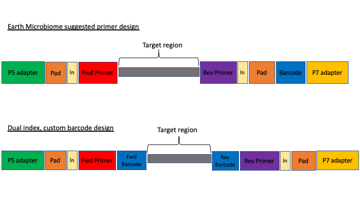
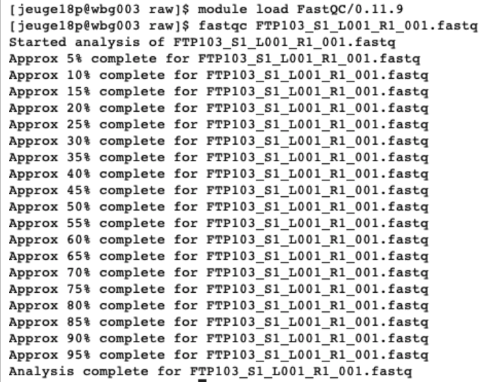
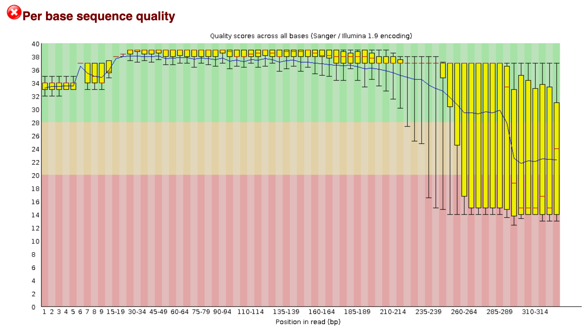
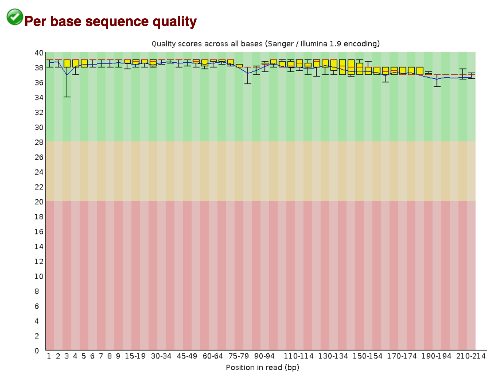

# Initial processing of raw sequence data

We will start where almost any data analysis begins (after creating metadata files of course), processing our raw data file. 


## Amplicon primer design

There are many ways to design metabarcoding primers to amplify your region of your interest from environmental samples. We will not cover too much experimental design in this course, but the way the experiment was set up will always influence how you approach the analysis. 

Here are two common methods. 

<center></center>

The first design above comes from the <a href="https://earthmicrobiome.org/" target="_blank" rel="noopener noreferrer"><b>Earth Microbiome project</b></a>. In this method, the sequencing center will usually do the demultiplexing for you, because the barcode is in a region recognised by Illumina standard protocols. We will not cover this, but in these cases, you will get back a folder of multiple fastq sequence files, one for each sample (barcode). 

In the second case above, there are two barcodes, one on the forward primer (P5 adapter side) and one on the reverse (P7 adapter side). The advantage of this method, called *dual index*, is that it allows you to use the two barcodes in combination so you have fewer overall barcode-primers to order. However, you will need to demultiplex these sequences yourself. The example dataset uses this method. 

The next consideration is whether the sequencing method was *paired end* or *single end*. For paired end sequencing libraries, in the case of the EMP method, for each sample you will have one file for the forward sequence and one for the reverse; for the dual index strategy, you will have two files total, that will have to be demultiplexed in tandem. Usually in metabarcoding, after demultiplexing and filtering, the two pairs are merged together (and any that cannot be merged are not used). This is different from other types of NGS sequencing, like genome assembly or RNAseq, where the pairs are kept separate. 

The example dataset for today was created with single end sequencing, so there is just a single file. 


In order to use our data, we will have to clean it up by removing the primers and any sequence upstream or downstream of the primers, then filtering out any sequences that are too short or of low average quality. If the data has not been split into separate files for each sample, then we will need to also *demultiplex* the raw data file. 


To get started, navigate to the *raw* subfolder (assuming you are in the main directory):

```
cd raw
```

and then use the `ls` command to see the contents of the subfolder

```
ls -lh
```

The `h` option in the ls command stands for *human readable*. This option will show the size of large files as MB (megabytes) or GB (gigabytes), instead of a long string of numbers representing the number of kilobytes.


To start with, we will check the raw data file for quality and presence of adapters from sequencing. To do this we will use the program *FastQC* (website: <a href="https://www.bioinformatics.babraham.ac.uk/projects/fastqc/" target="_blank" rel="noopener noreferrer"><b>https://www.bioinformatics.babraham.ac.uk/projects/fastqc/</b></a>). 


This program has both a command line version and a graphical user interface (GUI). On NeSI, we will use the command line version. To run this, we first load the module:
    
```
module load FastQC/0.11.9
```

For many programs (though not all), you can see the options (*arguments*) available by entering the name of the program and then `-h`:

```
fastqc -h
```

You should see a long stream of options go by. For programs with many options that do not fit on the screen, you can 'pipe' the command to `less`, so that you can control how much you see:

```
fastqc -h | less
```

you can then use the arrow keys to scroll through the options. Type `q` at any time to quit this view. 


We will now run FastQC on the fastq file in this subfolder:

```
fastqc FTP103_S1_L001_R1_001.fastq.gz
```


You should see the command running



This command will result in two outputs: a zipped folder containing all the separate results, and an `.html` file that has a summary in a format that can be read by your browser. In JupyterHub, you can double-click on this file and it will open in a new tab in your browser. 



The new tab will direct us to an interactive document. For eDNA data, we want to check in this report that:
  
1. The _per base sequence quality_ stays within the green area.
2. The _number of sequences_ you received.
3. The data does not contain _N_ bases.
4. All sequences have _the same length_, equal to the cycle number of the sequencing kit.


We will check the quality of the outputs after we have processed the data.

## Demultiplexing, trimming, and quality filtering

For the single-end, dual-indexed sequences that we are using today, we will need to demultiplex the raw fastq file. We also need to trim the primers and filter out low-quality reads. Fortunately, to avoid confusion we have written a short program that will do these steps for us. This program is freely available on the GitHub page. As well, on the workshop website, there are example commands for each of the steps.

The program, `cutadaptQC`, will read the primer and barcode sequences from the sample metadata file, and use these to create a new sequence file for each sample, which we can use for downstream analyses. 

As with fastqc, this program has options that you view with the `-h` argument:

```
./cutadaptQC -h
```

```
usage: cutadaptQC [-h] [-p METADATAFILE] [-f FASTQ] [-m MIN_LENGTH] [-t THREADS]

run cutadapt adapter trim and QC filtering

optional arguments:
  -h, --help            show this help message and exit
  -p METADATAFILE, --metadata_file METADATAFILE
                        project metadata file
  -f FASTQ, --raw_fastq FASTQ
                        raw fastq file to be demultiplexed and trimmed
  -m MIN_LENGTH, --min_length MIN_LENGTH
                        [OPTIONAL] minimum length for reads (default:150)
  -t THREADS, --threads THREADS
                        [OPTIONAL] number of CPUs to use (default:1)
```


Because there are a few options to add here, we will be running this program using a *bash script*, which is a simple text file in which we will enter the commands and options. This script will then be run on the command line. 

To start, click on on the folder tab in the upper left corner of the browser. This will open the File Browser. Navigate to the main folder and then double click on the scripts folder. Then click on the arrow above the file view, to open a new Launcher tab. On the bottom of this tab, click on the *Text File* button. A new text file will open in the tab. 

At the very top line of the new script, type the following:

```
#!/bin/bash
```

This is called the *shebang* and it tells the computer what program to use to run the script. 

Next, we will have the script read from another file called `envs.sh` that contains the modules needed to run the program, along with a command that adds the scripts folder to the working path so that the script can find the program. 

```
source envs.sh
```


Next, we have to tell the script where to go to run this program. The script will be run from the `scripts` folder, so we can use a *relative path* to tell the script to move to the `data` folder:

```
cd ../data
```


Now, we can add the actual command to the script. When we ran the help command for this program, it gave us the options we need to input along with the name of the program. 

```
cutadaptQC -h
```

and the output:

```
usage: cutadaptQC [-h] [-p METADATAFILE] [-f FASTQ] [-m MIN_LENGTH] [-t THREADS]

run cutadapt adapter trim and QC filtering

optional arguments:
  -h, --help            show this help message and exit
  -p METADATAFILE, --metadata_file METADATAFILE
                        project metadata file
  -f FASTQ, --raw_fastq FASTQ
                        raw fastq file to be demultiplexed and trimmed
  -m MIN_LENGTH, --min_length MIN_LENGTH
                        [OPTIONAL] minimum length for reads (default:150)
  -t THREADS, --threads THREADS
                        [OPTIONAL] number of CPUs to use (default:1)

```


So, after the `cd` command, we enter the name of the program, and then a `-f` for the first parameter, or argument. After this we need to enter the name of the raw fastq file. 

```
-f FTP103_S1_L001_R1_001.fastq.gz
```

The program will read from the sample metadata file to know which barcode and primer sequences to use for each sample. The `-p` option will tell the program which metadata file to use. As this file is in the `docs/` folder, we have to add the (relative) path:

```
-p ../docs/sample_metadata.tsv
```

Finally, we need to input the minimum length desired for the final sequences. For this project, the default of 150 is what we will use, but for practice we will add this option:

```
-m 150
```

All of the components of this command should be on the same line. So, the final script should look like this:

```
#!/bin/bash

source envs.sh

cd ../data

cutadaptQC -f FTP103_S1_L001_R1_001.fastq.gz -p ../docs/sample_metadata.tsv -m 150
```

Now we need to rename the script so we can keep all our scripts straight. In the top tab, you can right-click and choose 'rename file'; a window will pop up, and you just enter the new name:

trim_qc.sh

NOTE: you can also use the terminal to rename this file:

```
mv untitled.txt trim_qc.sh
```


In order to run this file, we need to make it *executable*. In the terminal, use this command:

```
chmod a+x trim_qc.sh
```

Now, to run this command, in the terminal run it like this:

```
./trim_qc.sh
```

If it works, then you should see the outputs begin to be generated. This will take a couple of minutes to run. While this is running, in the Folder tab, you can navigate over to the data folder, where you should see new subfolders with the trimmed fastq and fasta files.


Once the script has finished, you should have three new subfolders in your data/ folder: 

- trimmed
- fastq
- fasta

The `/trimmed` subfolder has the fastq sequence files from which primers and barcode sequences have been removed. There is now one for each sample. The `/fastq` folder has the fastq sequence files files, in which each file has taken the corresponding trimmed file and run a quality filter and removed any sequences below the minimum length. The fasta files in the `/fasta` are from the fastq files, from which any quality information has been removed. 

In the terminal, we will have a peak at each of these files:

```
cd ../data/trimmed

head -12 AM1_trim.fastq
```

Let's run FastQC on one of these sequences to compare to the original:

```
fastqc AM1_trim.fastq
```

We will not see much immediate difference at the \_filt.fastq files. But using fastqc we will see a little more.

```
cd ../fastq

head -12 AM1_filt.fastq

fastqc AM1_filt.fastq
```


Now, open up these two fastqc outputs (double-click on the .html file), and see if there are any differences



