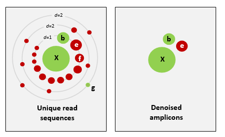

# Denoising or clustering the sequences

### Introduction

Now that our sequences have been trimmed and filtered, we can proceed to the next step, which will create a set of representative sequences. We do this by clustering all the sequences to look for biologically meaningful sequences--those that are thought to represent actual taxa, while trying to avoid differences caused by sequence or PCR errors, and remove any *chimeric* sequences.

Scientists are currently debating on what the best approach is to obtain `biologically meaningful` or `biologically correct` sequences. There are numerous papers published on this topic. Unfortunately, this is something that is outside the scope of this workshop to go into at depth. But here is the basic information…  
  
There are basically two trains of thought, clustering the dataset or denoising the dataset. With clustering the dataset, an OTU (Operational Taxonomic Unit) sequence should be at least a given percentage different from all other OTUs and should be the most abundant sequence compared to similar sequences. People traditionally chose to cluster at 97%, which means that the variation between sequences should be at least 3%. The concept of OTU clustering was introduced in the 1960s and has been debated ever since. With denoising the dataset, on the other hand, the algorithm attempts to identify all correct biological sequences in the dataset, which is visualized in the figure below. This schematic shows a clustering threshold at 100% and trying to identify errors based on abundance differences. The retained sequences are called ZOTU or Zero-radius Operational Taxonomic Unit. In other software programs they might also be called ASVs.

For purposes of clarity, we will call all these representative sequences **OTUs**, as that is the most common and oldest term for this type.



This difference in approach may seem small but has a very big impact on your final dataset!  
  
When you denoise the dataset, it is expected that one species may have more than one ZOTU, while if you cluster the dataset, it is expected that an OTU may have more than one species assigned to it. This means that you may lose some correct biological sequences that are present in your data when you cluster the dataset, because they will be clustered together. In other words, you will miss out on differentiating closely related species and intraspecific variation. For denoising, on the other hand, it means that when the reference database is incomplete, or you plan to work with ZOTUs instead of taxonomic assignments, your diversity estimates will be highly inflated.  
  
For this workshop, we will follow the denoising pathway, since most people are working on vertebrate datasets with good reference databases and are interested in taxonomic assignments.


Prior to clustering or denoising, we need to dereplicate our data into unique sequences. Since metabarcoding data is based on an amplification method, the same starting DNA molecule can be sequenced multiple times. In order to reduce file size and computational time, it is convenient to combine these duplicated sequences as one and retain information on how many were combined. Additionally, we will remove sequences that only occur once in our data and attribute them to sequence and PCR error. Lastly, we will sort the sequences based on abundance.

For the first step, we will combine all of the fasta files into a single file. In the terminal, navigate to the `/data/fasta` folder:

```
cd ../data/fasta
```

Now we will just concatenate all the fasta files into one using the `cat` command:

```
cat *.fasta > combined.fasta
```


The next commands we will run through bash scripts, as we did with the demultiplexing and trimming. Navigate back to the `/scripts` folder and create a new script. Save this as `dereplicate_seqs.sh`


Remember to add the *shebang* to the first line of the script

```
#!/bin/bash
```

For this and the next scripts, we will use the program <a href="https://github.com/torognes/vsearch" target="_blank" rel="noopener noreferrer"><b>VSEARCH</b></a>, so read from the `envs.sh` file as you did in the previous script.

```
source envs.sh
```

We will create and keep our OTU files in a separate folder, so add a line to navigate to this folder:

```
cd ../otus
```

We will actually run two commands in this script: one to dereplicate the fasta files and another to sort the sequences by abundance of reads belonging to each replicate

In a bash script we can run these commands sequentially by just putting them one after another:

```
vsearch --derep_fulllength ../data/fasta/combined.fasta --minuniquesize 2 --sizeout --output derep_combined.fasta --relabel Uniq.

vsearch --sortbysize derep_combined.fasta --output sorted_combined.fasta

```

Note how the second command uses as input the output of the first command. 


To run the script, you just have to make it executable and run it, as with the `trim_qc.sh` script

```
chmod a+x dereplicate_seqs.sh

./dereplicate_seqs.sh
```


To check if it worked, navigate over to the otus folder and check:

```
cd ../otus

ls
```

or you can just list the files from the scripts folder:

```
ls ../otus
```


The next script will run the commands to denoise the sequences and create a frequency table. On your own, create a script named `denoise.sh` to run the following three commands:

```
vsearch --cluster_unoise sorted_combined.fasta --sizein --sizeout --fasta_width 0 --centroids centroids.fasta

vsearch --uchime3_denovo centroids.fasta --sizein --fasta_width 0 --nonchimeras otus.fasta --relabel OTU.

vsearch --usearch_global combined.fasta --db otus.fasta --id 0.9 --otutabout otu_frequency_table.tsv
```

Check the commands above, do you need to change any paths?

The results of the last script creates three files: `centroids.fasta`, `otus.fasta`, and `otu_frequency_table.tsv`. Let's have a look at these files to see what is output. From looking at the output, can you guess what some of these VSEARCH parameters are doing?

- `--sizein`
- `--sizeout`
- `--centroids`
- `--relabel`

How about `--fasta_width 0`? Try rerunning the script without this command to see if you can tell what this option is doing. 

## Optional extra

We discussed the difference between denoising and clustering. You can change the last script to have VSEARCH do clustering instead of denoising. Make a new script to run clustering. It is similar to `denoise.sh`, except you do not use the `vsearch --cluster_unoise` nor `vsearch --uchime3_denovo` commands. Instead you will use:

```
vsearch --cluster_size sorted_combined.fasta --centroids cluster_otus.fasta --relabel otu. --id 0.97 --sizeout
```

You will still need a command to create a frequency table. Make sure to change the names of the files so that you are making a **new** frequency table. If you leave the old name in, it will be overwritten when you run this script. 

Give it a try and compare the number of OTUs between clustering and denoising outputs. 

the `--id` argument is critical for clustering. What happens if you raise or lower this number? Try rerunning the script to see how it changes the results. Note: make sure to rename the output each time or you will not be able to compare to previous runs. 

